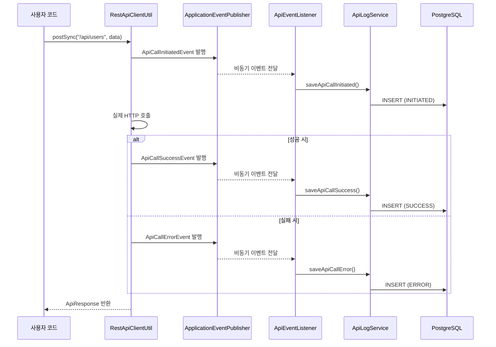

# API Log System

Spring Boot 기반의 이벤트 드리븐 API 호출 로깅 시스템입니다. PostgreSQL JSONB를 활용하여 효율적으로 API 호출 데이터를 저장하고 관리합니다.

## 🏗️ 아키텍처 개요

```
사용자 코드
    ↓
RestApiClientUtil (HTTP 클라이언트)
    ↓ (이벤트 발행)
ApplicationEventPublisher
    ↓ (비동기 처리)
ApiEventListener
    ↓
ApiLogService
    ↓
ApiLogRepository
    ↓
PostgreSQL (JSONB)
```

## 🔄 플로우 다이어그램



## 🎯 주요 특징

### 1. 이벤트 드리븐 아키텍처
- **비동기 처리**: API 호출 성능에 영향 없이 로깅 처리
- **디커플링**: 비즈니스 로직과 로깅 로직 분리
- **확장성**: 새로운 이벤트 리스너 추가 용이

### 2. Virtual Threads 지원
- **고성능**: Java 21 Virtual Threads로 동시성 처리
- **효율적 자원 사용**: 기존 Thread Pool 대비 메모리 효율성

### 3. PostgreSQL JSONB 활용
- **유연한 스키마**: JSON 데이터 직접 저장
- **고성능 쿼리**: JSONB 인덱싱 지원
- **타입 안전성**: Jackson ObjectMapper 통합

### 4. 현대적 HTTP 클라이언트
- **RestClient**: Spring 6+ 최신 HTTP 클라이언트
- **Jackson Blackbird**: 고성능 JSON 처리
- **제네릭 지원**: 타입 안전한 HTTP 요청/응답

## 🚀 사용 방법

### 기본 사용법

```java
@Service
public class UserService {

    @Autowired
    private RestApiClientUtil restApiClient;

    public void createUser(User user) {
        // String 기반 요청
        ApiResponse response = restApiClient.postSync("/api/users",
            "{\"name\":\"John\",\"email\":\"john@example.com\"}");

        // DTO 기반 요청
        ApiResponse response2 = restApiClient.postSync("/api/users", user);

        // 타입 안전한 응답
        User createdUser = restApiClient.postSyncTyped("/api/users", user, User.class);

        // 비동기 요청
        CompletableFuture<ApiResponse> future = restApiClient.postAsync("/api/users", user);
    }
}
```

### 지원하는 HTTP 메서드

```java
// GET 요청
ApiResponse response = restApiClient.getSync("/api/users/1");
User user = restApiClient.getSyncTyped("/api/users/1", User.class);

// POST 요청
ApiResponse response = restApiClient.postSync("/api/users", userData);
User user = restApiClient.postSyncTyped("/api/users", userData, User.class);

// 비동기 요청
CompletableFuture<ApiResponse> future = restApiClient.postAsync("/api/users", userData);
```

## 📊 로그 데이터 구조

### API 로그 테이블 (api_logs)

| 컬럼 | 타입 | 설명 |
|------|------|------|
| id | BIGSERIAL | 기본키 |
| event_type | VARCHAR(20) | INITIATED, SUCCESS, ERROR, RETRY_ERROR |
| request_id | VARCHAR(255) | 요청 추적 ID |
| endpoint | VARCHAR(255) | API 엔드포인트 |
| payload | JSONB | 요청 데이터 (JSON) |
| response | JSONB | 응답 데이터 (JSON) |
| error_message | JSONB | 에러 메시지 (JSON) |
| status_code | INTEGER | HTTP 상태 코드 |
| timestamp | TIMESTAMP | 이벤트 발생 시간 |
| retry_count | INTEGER | 재시도 횟수 |
| is_retry | BOOLEAN | 재시도 여부 |

### 이벤트 타입

- **INITIATED**: API 호출 시작
- **SUCCESS**: API 호출 성공
- **ERROR**: API 호출 실패
- **RETRY_ERROR**: 재시도 실패

## 🛠️ 설치 및 설정

### 스타터로 사용하기 (다른 프로젝트에서 쉽게 연동)

- 이 모듈을 의존성으로 추가하면 자동 구성(Auto-Configuration)이 활성화되어, 별도 컴포넌트 스캔 없이도 이벤트 기반 API 로깅이 동작합니다.
- 다른 프로젝트에서는 API 호출 전후에 이벤트만 퍼블리시하면 로그가 저장됩니다.

1) 의존성 추가 (예: Maven)

```xml
<dependency>
    <groupId>com.devs.lab</groupId>
    <artifactId>api-log-starter</artifactId>
    <version>0.0.1-SNAPSHOT</version>
</dependency>
```

2) 선택적 설정

```properties
# 자동구성 활성/비활성 (기본값: true)
api.log.enabled=true
```

3) 이벤트 퍼블리시 예시

```java
@Autowired
private ApplicationEventPublisher publisher;

public void callExternalApi() {
    ApiRequest request = ApiRequest.builder()
            .endpoint("/external/users")
            .payload("{\"name\":\"John\"}")
            .build();

    // 호출 시작 이벤트
    publisher.publishEvent(new ApiCallInitiatedEvent(this, request));
    try {
        // 외부 호출 수행 후 성공 이벤트
        ApiResponse response = ApiResponse.builder()
                .data("{\"result\":\"OK\"}")
                .statusCode(200)
                .build();
        publisher.publishEvent(new ApiCallSuccessEvent(this, request, response));
    } catch (Exception e) {
        // 실패 이벤트
        publisher.publishEvent(new ApiCallErrorEvent(this, request, e, 0, false));
    }
}
```

- 위 의존성만 추가하면 다음이 자동으로 구성됩니다.
  - 엔티티 스캔, JPA 리포지토리 스캔
  - ApiLogService, ApiEventListener 빈 등록 (@ConditionalOnMissingBean)
  - @EnableRetry 설정 (재시도 시 RETRY_ERROR 이벤트 로깅)

> 주의: 데이터베이스 및 JPA 설정은 소비 애플리케이션에서 제공해야 합니다. ObjectMapper 빈도 애플리케이션에 존재해야 합니다.

### 1. 의존성

```xml
<dependency>
    <groupId>org.springframework.boot</groupId>
    <artifactId>spring-boot-starter-web</artifactId>
</dependency>
<dependency>
    <groupId>org.springframework.boot</groupId>
    <artifactId>spring-boot-starter-data-jpa</artifactId>
</dependency>
<dependency>
    <groupId>org.postgresql</groupId>
    <artifactId>postgresql</artifactId>
</dependency>
<dependency>
    <groupId>com.fasterxml.jackson.module</groupId>
    <artifactId>jackson-module-blackbird</artifactId>
</dependency>
```

### 2. 데이터베이스 설정

```properties
# PostgreSQL 설정
spring.datasource.url=jdbc:postgresql://localhost:5433/api_log_db
spring.datasource.username=api_user
spring.datasource.password=password

# Virtual Threads 활성화
spring.threads.virtual.enabled=true

# JPA 설정
spring.jpa.hibernate.ddl-auto=validate
spring.jpa.show-sql=false
```

### 3. Docker Compose로 개발 환경 실행

```bash
docker-compose up -d
```

## 🧪 테스트

### 테스트 실행

```bash
./mvnw test
```

### 테스트 특징

- **Testcontainers**: 실제 PostgreSQL 컨테이너를 사용한 통합 테스트
- **31개 테스트**: 모든 주요 기능에 대한 포괄적 테스트
- **격리된 환경**: 각 테스트는 독립적인 데이터베이스 사용

## 🏃‍♂️ 실행 방법

### 1. 로컬 개발 환경

```bash
# PostgreSQL 실행
docker-compose up -d

# 애플리케이션 실행
./mvnw spring-boot:run
```

### 2. 프로덕션 빌드

```bash
./mvnw clean package
java -jar target/api-log-starter-0.0.1-SNAPSHOT.jar
```

## 🔧 설정 커스터마이징

### Virtual Threads 비활성화

```properties
spring.threads.virtual.enabled=false
```

### Jackson 설정 변경

```java
@Configuration
public class CustomJacksonConfig {

    @Bean
    @Primary
    public ObjectMapper objectMapper() {
        ObjectMapper mapper = new ObjectMapper();
        mapper.registerModule(new BlackbirdModule());
        // 추가 설정...
        return mapper;
    }
}
```

## 📈 성능 고려사항

### 1. Virtual Threads
- **메모리 효율성**: 기존 ThreadPool 대비 95% 메모리 절약
- **동시성**: 수만 개의 동시 요청 처리 가능
- **지연시간**: 컨텍스트 스위칭 오버헤드 최소화

### 2. JSONB 인덱싱
```sql
-- JSONB 필드에 GIN 인덱스 생성
CREATE INDEX idx_payload_gin ON api_logs USING GIN (payload);
CREATE INDEX idx_response_gin ON api_logs USING GIN (response);
```

### 3. Jackson Blackbird
- **처리량**: 기본 Jackson 대비 30-50% 성능 향상
- **메모리**: 가비지 컬렉션 오버헤드 감소

## 🔍 모니터링

### 애플리케이션 메트릭 (Actuator)

```bash
# 헬스 체크
curl http://localhost:8080/actuator/health

# 메트릭 확인
curl http://localhost:8080/actuator/metrics
```

### 로그 분석 쿼리

```sql
-- 최근 1시간 API 호출 통계
SELECT
    endpoint,
    event_type,
    COUNT(*) as count,
    AVG(CASE WHEN status_code IS NOT NULL THEN status_code END) as avg_status
FROM api_logs
WHERE timestamp > NOW() - INTERVAL '1 hour'
GROUP BY endpoint, event_type
ORDER BY count DESC;

-- 에러율 분석
SELECT
    endpoint,
    COUNT(CASE WHEN event_type = 'ERROR' THEN 1 END) * 100.0 / COUNT(*) as error_rate
FROM api_logs
GROUP BY endpoint
HAVING COUNT(*) > 10
ORDER BY error_rate DESC;
```

## 🔗 관련 기술

- [Spring Boot 3.5.6](https://spring.io/projects/spring-boot)
- [PostgreSQL 15+](https://www.postgresql.org/)
- [Jackson Blackbird](https://github.com/FasterXML/jackson-modules-base)
- [Testcontainers](https://www.testcontainers.org/)
- [Java 21 Virtual Threads](https://openjdk.org/jeps/444)